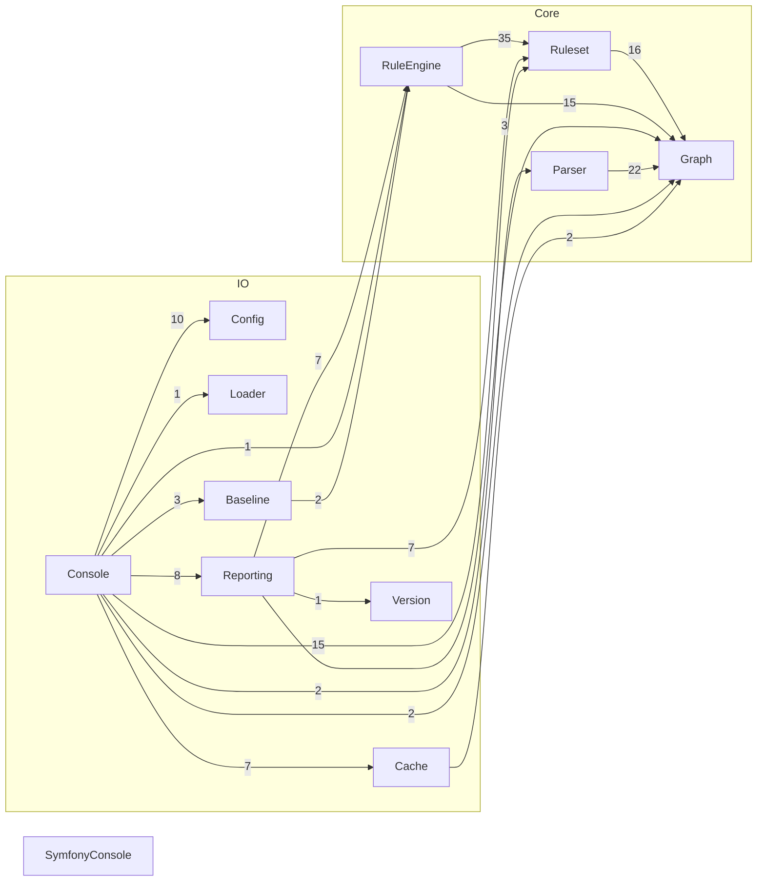

# Spandrel Architecture

Dogfooding ruleset: Spandrel analysing its own codebase. Reflects the
actual current dependency structure under `Spandrel\Spandrel\` — 11
namespaces, `Version` the newest, holding the git tag/commit `box
compile` bakes into a release build (see [box.json](../box.json)) and
what the SARIF reporter's `tool.driver.version` reports.

Layers are declared via the `{Layer}` placeholder form — see
[docs/ruleset.md](ruleset.md#auto-derived-layers-placeholders) —
so each namespace segment directly under `Spandrel\Spandrel\` becomes
its own layer automatically as real code is added, without a bullet
needing to be added here by hand.

## Meta

- Any class not in a layer violates rules.
- A file that fails to parse violates rules.
- Every layer must be used in a rule.

## Layers

- `Spandrel\Spandrel\{Layer}\**`

- **IO** groups `Config`, `Loader`, `Cache`, `Reporting`, `Console`, `Baseline`, and `Version`
- **Core** groups `Graph`, `Ruleset`, `Parser`, and `RuleEngine`

`SymfonyConsole` below is a live reference example of an [external
layer](ruleset.md#external-layers): a named vendor
pattern the rule below can enforce against, with nothing added to
`source.paths` in `spandrel.yaml` — Spandrel still parses only `src`.

- **SymfonyConsole** matches `Symfony\Component\Console\**`

## Rules

- `Core` must not depend on `IO`
- `IO` may depend on anything
- `Core` must not depend on `SymfonyConsole`

- `Config` depends on nothing
- `Graph` depends on nothing
- `Loader` depends on nothing
- `Version` depends on nothing

- `Parser` may only depend on `Graph`
- `Ruleset` may only depend on `Graph`
- `RuleEngine` may only depend on `Graph` and `Ruleset`
- `Cache` may only depend on `Graph`
- `Reporting` may only depend on `RuleEngine`, `Graph`, `Ruleset`, and `Version`
- `Baseline` may only depend on `RuleEngine`

- `Console` may depend on anything

## Diagram

Generated via `analyse --report=mermaid`; a snapshot, not kept in sync
automatically — regenerate with:

```sh
docker compose run --rm php php bin/spandrel.php analyse src --ruleset=docs/architecture.md --report=mermaid
```


